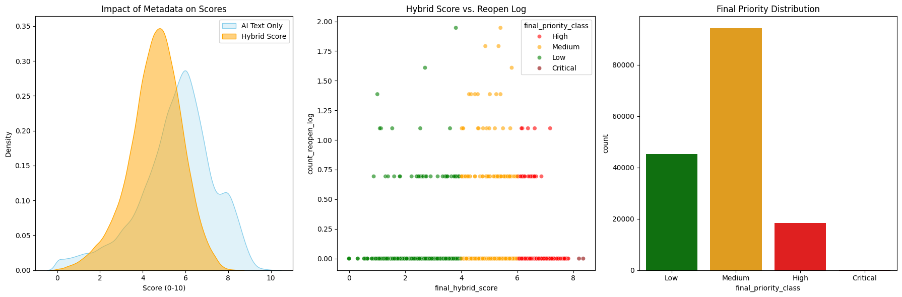
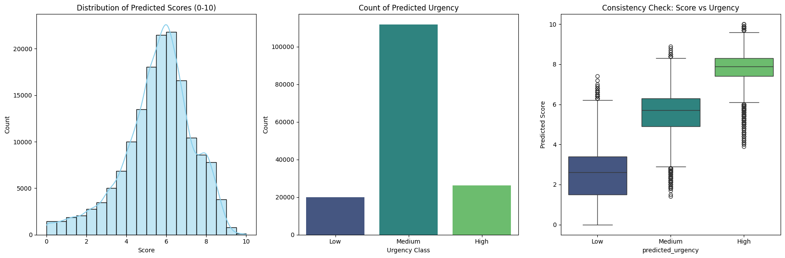
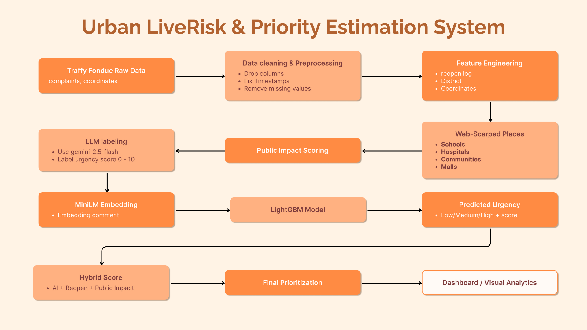

# Urban LiveRisk & Priority Estimation System  
**ระบบประเมินความเสี่ยงและความเร่งด่วนแบบเรียลไทม์**

> Traffy Fondue × Web-scraped Public Places × LLM × ML  
> Real-world urban analytics for risk & urgency prediction

---

## 🌆 Project Overview

This project builds a complete end-to-end pipeline for analyzing and predicting the **urgency level** of citizen-reported issues across Bangkok.

The system integrates multiple data sources and AI methods:

### **1) Data Engineering (DE)**
- Clean raw **Traffy Fondue** data.
- Web-scrape locations of important public places (schools, hospitals, communities, malls).
- Compute **Public Impact** based on geographic proximity.
- Engineer features such as reopen behavior, normalized scores, timestamps, etc.

### **2) AI / ML**
- Use **LLM (Gemini 2.5-flash)** to generate urgency labels (0–10).
- Convert complaint text into semantic vectors using **MiniLM embedding model**.
- Train a **LightGBM classifier + regressor** to predict urgency levels for all records.
- Combine multiple signals into a **Final Hybrid Score**.

### **3) Visualization**
- Histograms, scatter plots, spatial analysis.
- Identify districts with highest urgency.
- Prototype Streamlit dashboard for interactive exploration.

---

## 📌 System Preview

### Relationship between Public Impact, Reopen Count, and AI Score


### Predicted Urgency Distribution


---

## 🧠 Diagram



---

## 📂 Repository Structure
```
MISSING-SCORE-DSDE/
├── AIML/
│   ├── data/
│   │   ├── genai_score_data.csv
│   │   ├── result.csv
│   │   └── test.ipynb
│   ├── 2_GenAI_Score.ipynb
│   └── 3_Model_Prediction.ipynb
│
├── DE/
│   ├── data/
│   │   ├── bangkok_traffy.csv
│   │   ├── cleaned_df.csv
│   │   └── gdf_public_impact.csv
│   ├── 0_Data_Preparation.ipynb
│   ├── 1_1_Data_Engineer.ipynb
│   └── 1_2_Spark.ipynb
├── DV/
│   ├── mapenv/                     # virtual environment (optional / local use)
│       ├── page/                   # Streamlit page modules
│       ├── scattermap.py           # scatter-based visualization
│       └── sidebar_filters.py      # sidebar UI filters for Streamlit
│
├── Places/          # Web-scraped public-place datasets
├── pics/            # Figures & diagrams
├── .gitignore
└── README.md
```
---

## 📊 Dataset Details & Downloads

### 1. Traffy Fondue (Raw → Clean)

#### **`bangkok_traffy.csv` — Original Dataset**  
📥 Download: https://drive.google.com/uc?id=1AGLYsyeCptBibJYhA79k-6OEfKzOJqL3  

#### **`cleaned_df.csv` — Cleaned Data**  
📥 Download: https://drive.google.com/uc?id=1NnlFIt5zL8i6vO5BuxQHhPTGprGn0Rbo  

**Main Columns:**
- `ticket_id`
- `comment`
- `coords`
- `district`
- `timestamp`
- `count_reopen`
- `count_reopen_log` (log-transformed)

**Cleaning Steps:**
- Drop unused fields (`photo`, `organization`, `type`, etc.)
- Remove missing / duplicated comments  
- Convert timestamp → datetime  
- Filter dataset to **year 2022**  
- Apply log transform to reopen count  

---

### 2. Public Impact Dataset

#### **`gdf_public_impact.csv`**  
📥 Download: https://drive.google.com/uc?id=1TWaXhd9-3PqjusF3lgyA_UKI2qwOE7mU  

**Columns:**
- Base fields: `ticket_id`, `comment`, `district`, `timestamp`
- Coordinates: `lng`, `lat`
- `public_impact`: calculated from distance to:
  - schools,
  - hospitals,
  - communities,
  - department stores.

**Interpretation:**  
ยิ่งใกล้สถานที่สำคัญมาก → **public_impact สูงขึ้น** (potential harm to more people).

---

### 3. GenAI LLM Scores (Training Labels)

#### **`genai_score_data.csv`**  
📥 Download: https://drive.google.com/uc?id=1H_heleE31NbjAIdU1CMmfOr5VSxACUjH  

Fields:
- `ticket_id`
- `comment`
- `ai_urgency` (Low / Medium / High)
- `ai_score` (0–10)

Used as **ground truth** for ML training.

---

### 4. Final Output Dataset

#### **`result.csv` — Final Prediction Results**  
📥 Download: https://drive.google.com/uc?id=1LXhIP-NwjLuG3gt2DZNpXCCWkPcCnFPa  

Includes:

| Field | Meaning |
|-------|---------|
| `predicted_score` | ML-predicted urgency score (0–10) |
| `predicted_urgency` | Urgency label (L/M/H) |
| `score_reopen_norm` | Normalized reopen score |
| `score_impact_norm` | Normalized public impact |
| `final_hybrid_score` | Combined score (AI + Reopen + Impact) |
| `final_priority_class` | Final urgency class |
| `score_lift` | Hybrid score – AI score difference |

---

## 🏛️ Web Scraping of Public Places

Collected datasets:

| Place Type | Source |
|------------|--------|
| Department Stores | data.bangkok.go.th |
| Communities | cpudgiapp.bangkok.go.th |
| Schools | bmagis.bangkok.go.th |
| Hospitals | bmagis.bangkok.go.th |

Processing steps:

1. Clean text encoding & column names  
2. Normalize coordinate formats  
3. Keep minimal fields (`type`, `lat`, `lng`)  
4. Use as a spatial layer to compute **public impact score**

**Goal:**  
> Measure how many people may be affected by each issue, based on location.

---

## 🤖 AI & Machine Learning Component

### **1. MiniLM Text Embedding Model**

Model: `sentence-transformers/paraphrase-multilingual-MiniLM-L12-v2`

- Converts comments into **384-dimensional embeddings**.
- Vector captures the *semantic meaning* of the complaint.
- Similar problems → similar embedding patterns.

Used as input for the ML model.

---

### **2. LLM Labeling (Gemini 2.5-flash)**

- LLM scores urgency on a **0–10 scale**.
- Analyzes:
  - context  
  - severity  
  - risk keywords  
  - danger implications  

Used to create training labels for the LightGBM model.

---

### **3. LightGBM Urgency Prediction Model**

Uses:

- MiniLM embeddings  
- Reopen behavior (`count_reopen_log`)  
- Public Impact (`public_impact`)  
- LLM labels  

Outputs:

- `predicted_score` (0–10)  
- `predicted_urgency` (Low / Medium / High)  

Then:

- Combine with other signals → **final_hybrid_score**
- Assign **final_priority_class** (priority level for city operations)

---

## 🔧 Data Engineering Details

Main notebooks:
- `0_Data_Preparation.ipynb`
- `1_1_Data_Engineer.ipynb`
- `1_2_Spark.ipynb`

Key processing:

- Remove unused columns  
- Clean text fields  
- Drop duplicates  
- Transform reopen counts  
- Normalize numerical fields  
- Construct geospatial features  
- Build public impact using distance calculations  
- Use Spark to scale large datasets  

Tools:
- Pandas  
- PySpark  
- Requests + BeautifulSoup  
- GeoPandas  

---

## 📈 Visualization Components

Tools:
- Matplotlib  
- Seaborn  
- GeoPandas  
- Streamlit  

Examples of visualizations:

- Histogram of urgency scores  
- Scatter: impact vs reopen  
- Spatial map per Bangkok district  
- Complaints per district  
- Urgency distribution summary  

Future UI Adjustments:
- Allow filtering districts  
- Adjust weights of hybrid model  
- Toggle public place types  

---

## 🙏 Acknowledgements 🙏

- Traffy Fondue — Original dataset
- Bangkok Metropolitan Administration (BMA) — Open geospatial data
- Google Gemini, HuggingFace, LightGBM
- Tools: Pandas, Spark, GeoPandas, Streamlit

---

## 👥 Members
```
Khanes Tantiwatthanarom
Purinut Jamma 
Natthanicha Jamjuree
Nuttamas Udomsantitham
Patcharamon Seehra
Picharyawee Chartruanglerd
```

---

## 📽️ Presentation
👉 [Click to View Presentation on Canva](https://www.canva.com/design/DAG5sUlbMyI/xHvMby2x4Kx88agO2kQWaw/edit?utm_content=DAG5sUlbMyI&utm_campaign=designshare&utm_medium=link2&utm_source=sharebutton)
